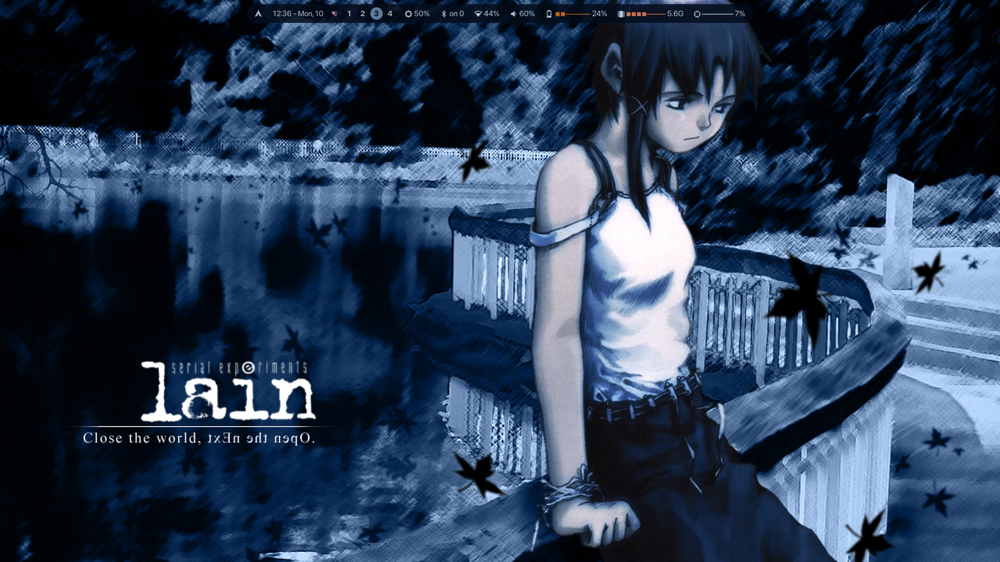
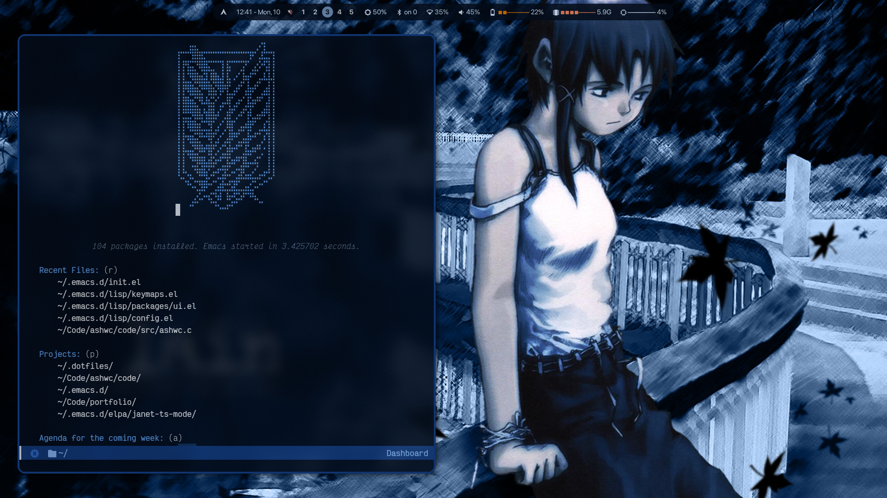
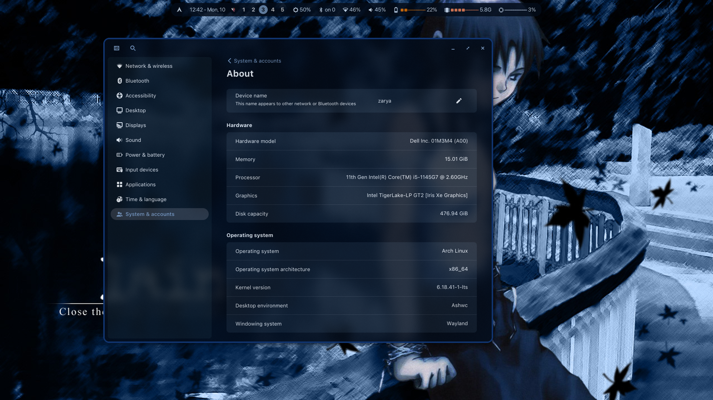

* ashwin's dotfiles
these are all my dotfiles for linux/unix-like operating systems. they are managed in a git repo and symlinked using ~gnu stow~.

** configurations
- [[https://github.com/shadowash8/ashrwm][ashrwm]]
- [[https://github.com/shadowash8/ashwal][ashwal]]
- [[https://github.com/shadowash8/ashwc][ashwc]]
- [[https://www.gnu.org/software/bash/][bash]]
- [[https://github.com/dunst-project/dunst][dunst]]
- [[https://www.gnu.org/software/emacs/][emacs]]
- [[https://codeberg.org/dnkl/foot][foot]]
- [[https://github.com/glide-browser/glide/][glide]]
- [[https://hypr.land/][hypr]]
- [[https://i3wm.org/][i3wm]]
- [[https://github.com/jtroo/kanata/][kanata]]
- [[https://github.com/rvaiya/keyd/][keyd]]
- [[https://github.com/kovidgoyal/kitty][kitty]]
- [[https://github.com/InioX/matugen][matugen]]
- [[https://github.com/mangowm/mango/][mango]]
- [[https://www.musicpd.org/][mpd]]
- [[https://github.com/mpv-player/mpv][mpv]]
- [[https://github.com/neovim/neovim/][nvim]]
- [[https://www.lazyvim.org/][lazyvim]]
- [[https://github.com/yshui/picom][picom]]
- [[https://github.com/eylles/pywal16][pywal16]]
- [[https://qutebrowser.org/][qutebrowser]]
- [[https://codeberg.org/river/river][river]]
- [[https://rmpc.mierak.dev/][rmpc]]
- [[https://swaywm.org/][swaywm]]
- [[https://github.com/ErikReider/SwayNotificationCenter][swaync]]
- [[https://github.com/baskerville/sxhkd][sxhkd]]
- [[https://termux.dev/][termux]]
- [[https://github.com/tmux/tmux/][tmux]]
- [[https://github.com/Alexays/Waybar][waybar]]
- [[https://www.zsh.org/][zsh]]

** install
#+begin_src bash
  git clone https://github.com/shadowash8/dotfiles.git ~/.dotfiles
  cd ~/.dotfiles
  stow zsh ashwc waybar shell tmux
#+end_src

** screenshots

